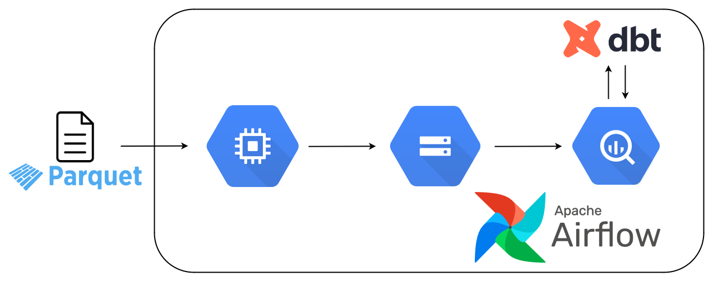
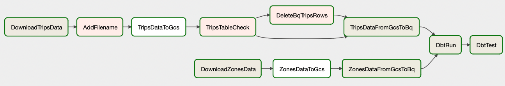

# NY Taxi - data pipeline

[NYC] is publishing datasets containing taxi trips records. Goal of this project is to create end-to-end data pipeline which contains Yellow Taxi Trips in records. 

## Project diagram

## Tools used
- Cloud - GCP:
	- Data Lake - Cloud Storage
	- Data Warehouse: BigQuery
- Apache Airflow
- DBT

## Process Description

## Taxi Data Part
### DownloadTripsData
Script downloads file with data (in parquet format) from [NYC] website. The date (month and year) is passed as an Airflow parameter in the link, which is generated from the paramter (logical_date). This allows you to use the backfill option.

### AddFilename
To the downloaded dataset we add name of file.

### TripsDataToGCS
Script uploads modified file to data lake - GCS.

### TripsTableCheck 
This step checks whether the file we downloaded is already uploaded to the data warehouse. If this condition is true - the script executes the next steps - **DeleteBQTripsRows** and **TripsDataFromGcsToBq**. If the data has not been uploaded to the data warehouse so far, the **TripsDataFromGcsToBq** step is performed.

### DeleteBQTripsRows
If our data is currently in the data warehouse, the script deletes it. It uses the previously added parameter - filename - to do so. This allows us to have full control over the data in the data warehouse and maintain the completeness of the data.

### TripsDataFromGcsToBq
When data is removed from the data warehouse or when it was not there before, data from the Data lake is loaded into the data warehouse. Thanks to the use of a step with checking whether a given file has been processed before, we are able to achieve better efficiency in uploading data - we do not upload all data files every time. 
## Zones Part
### DownloadZonesData
Script downloads csv file with data about Taxi zones.

### ZonesDataToGcs
Script uploads file to data lake - GCS.

### ZonesDataFromGcsToBq
Script uploads file from data lake to data warehouse BigQuery

## DBT Part
### DbtRun
Script runs dbt transformation. 

### DbtTest
Script runs dbt tests.

[//]: #
[NYC]: https://www.nyc.gov/site/tlc/about/tlc-trip-record-data.page